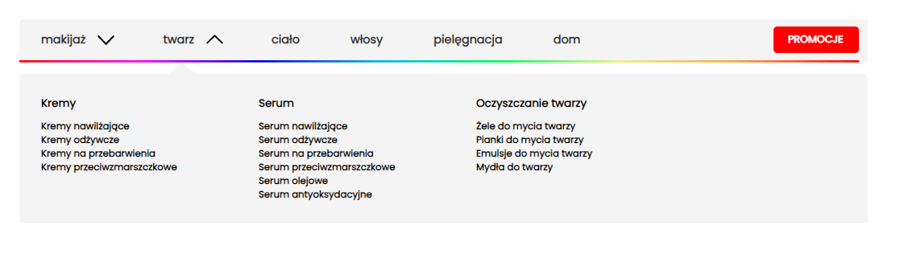

# Dropdown Menu Project

## Screenshots



## Description

This project is a simple implementation of a dropdown menu using pure HTML, Vanilla JavaScript, and SCSS. The menu features animation on expansion and collapse of items.

## Requirements

To run this project, you'll need a web browser that supports JavaScript.

## Installation and Usage

1. Clone the repository:

   ```bash
   git clone <https://github.com/DamianPasterz/recruitment-task1.git>
   ```

2. Navigate to the project directory:

   ```bash
   cd recruitment-task1
   ```

3. Open the `index.html` file in your web browser.

## Directory Structure

- `index.html`: Main HTML file containing the menu structure.
- `css/style.css`: CSS file generated from SCSS, containing menu styles.
- `js/script.js`: JavaScript file containing menu interaction logic.
- `scss/style.scss`: SCSS file containing CSS styles for the menu.

## Technologies Used

- HTML
- CSS (SCSS)
- JavaScript (Vanilla)

## Author

This project was created by [DamianPasterz]. Contact: [damian.pasterz@gmail.com].

## License

This project is licensed under the [MIT]. For more information, see the LICENSE.md file.
